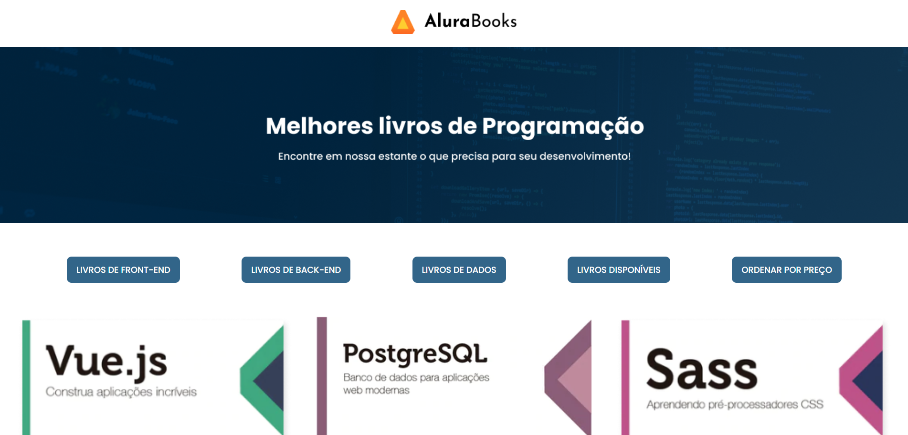

 Alura Books

Project of Alura Books Website

## Table of contents

- [Overview](#overview)
  - [The challenge](#the-challenge)
  - [Screenshot](#screenshot)
  - [Links](#links)
- [My process](#my-process)
  - [Built with](#built-with)
  - [What I learned](#what-i-learned)
  - [Continued development](#continued-development)
  - [Useful resources](#useful-resources)
- [Author](#author)

## Overview

A project challenged by [Alura](https://cursos.alura.com.br)

### The challenge

Users should be able to:

- Create Alura Books and its dinamic content using: 
    - `filter()` method;
    - `forEach()` method;
    - `map()` method;
    - `reduce()` method;
    - `sort()` method;

### Screenshot

### Links

- Solution URL: [GitHub respository](https://github.com/ViniCellist/Alura-Books)

## My process

- [main](./app/main.js) - Here is the main array requesting data from API JSON.

- [forEach](./app/forEachMethod.js) - Shows the main content based on API data delivered.

- [filter](./app/filterMethod.js) - Applies a logic through the main array, wich shows or not the content unavailable.

- [map](./app/map.js) - Get data from the main array and applies a logic on books prices

- [reduce](./app/reduceMethod.js) - another array from the main array that calculates every price value and returns a single value.

- [sort](./app/sortMethod.js) - The button funcionality to sort types.

### Built with

- HTML5
- CSS3
    - Flexbox
- JavaScript
    - Array
    - forEach
    - filter
    - map
    - reduce
    - sort
- API JSON

### What I learned

Array and funcionalities

### Continued development

Keep my focus on becoming a fullstack Dev...

### Useful resources

- [HTML](https://developer.mozilla.org/en-US/docs/Web) 
- [CSS](https://developer.mozilla.org/en-US/docs/Web/CSS)
- [JavaScript](https://developer.mozilla.org/pt-BR/docs/Web/JavaScript)
    - [Array](https://developer.mozilla.org/pt-BR/docs/Web/JavaScript/Reference/Global_Objects/Array)
    - [forEach](https://developer.mozilla.org/pt-BR/docs/Web/JavaScript/Reference/Global_Objects/Array/forEach)
    - [filter](https://developer.mozilla.org/pt-BR/docs/Web/JavaScript/Reference/Global_Objects/Array/filter)
    - [map](https://developer.mozilla.org/pt-BR/docs/Web/JavaScript/Reference/Global_Objects/Array/map)
    - [reduce](https://developer.mozilla.org/pt-BR/docs/Web/JavaScript/Reference/Global_Objects/Array/reduce)
    - [sort](https://developer.mozilla.org/pt-BR/docs/Web/JavaScript/Reference/Global_Objects/Array/sort)
- [API JSON](https://developer.mozilla.org/pt-BR/docs/Learn/JavaScript/Objects/JSON)

## Author

- GitHub - [Personal Profile](https://github.com/ViniCellist)
- LinkedIn - [Professional Profile](https://www.linkedin.com/in/vinicius-de-souza-duarte-57937b192/)
- Instagram - [Personal Profile](https://www.instagram.com/vinicius_duartesd/)